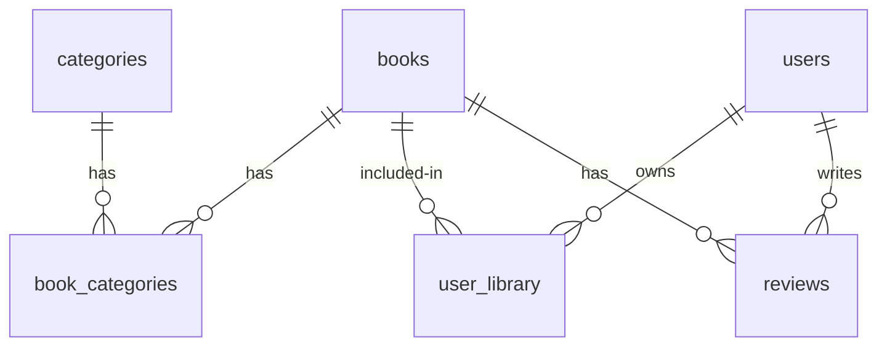

# 📚 Cloud Bookstore [](https://cloud-bookstore.vercel.app/)

A modern cloud-based digital bookstore platform with seamless reading experiences across devices. Discover, read, and manage your favorite books in one place.


## 🌟 Features

- **Cloud-Synced Library** - Access your bookshelf from any device
- **Smart Search** - Find books by title, author, or genre
- **Interactive Book Previews** - Read samples before purchasing
- **Personalized Recommendations** - AI-powered suggestions based on your reading habits
- **Secure Payments** - Integrated shopping cart and checkout system
- **Reading Progress Tracking** - Never lose your place in a book
- **Multi-device Sync** - Continue reading on any device

## 🚀 Quick Start

1. Clone the repository:
```bash
git clone https://github.com/yourusername/cloud-bookstore.git
cd cloud-bookstore
```

2. Install dependencies:
```bash
npm install
```

3. Set up environment variables (create `.env.local`):
```env
NEXT_PUBLIC_SUPABASE_URL=your_supabase_url
NEXT_PUBLIC_SUPABASE_ANON_KEY=your_anon_key
SUPABASE_SERVICE_KEY=your_service_key
NEXT_PUBLIC_APP_URL=http://localhost:3000
```

4. Start development server:
```bash
npm run dev
```

5. Seed the database:
```bash
npm run seed
```

## 🛠️ Tech Stack

- **Frontend**: Next.js 14 + TypeScript
- **Styling**: Tailwind CSS + Shadcn UI
- **Database**: Supabase PostgreSQL
- **State Management**: React Context + Zustand
- **Animation**: Framer Motion
- **Deployment**: Vercel

## 📦 Database Schema



## 🌐 Deployment

1. [](https://vercel.com/new/clone?repository-url=https%3A%2F%2Fgithub.com%2Fyourusername%2Fcloud-bookstore)

2. Set these environment variables in Vercel:
   - `NEXT_PUBLIC_SUPABASE_URL`
   - `NEXT_PUBLIC_SUPABASE_ANON_KEY`
   - `SUPABASE_SERVICE_KEY`
   - `NEXT_PUBLIC_APP_URL`

## 🤝 Contributing

1. Fork the repository
2. Create feature branch:
```bash
git checkout -b feature/amazing-feature
```
3. Commit changes:
```bash
git commit -m 'Add amazing feature'
```
4. Push to branch:
```bash
git push origin feature/amazing-feature
```
5. Open a Pull Request

## 📄 License

MIT License - see [LICENSE](LICENSE) for details

---

[Explore Live Demo](https://cloud-bookstore.vercel.app/) | [Report Issue](https://github.com/yourusername/cloud-bookstore/issues) | [Request Feature](https://github.com/devjoshi2804/cloud-bookstore/issues)